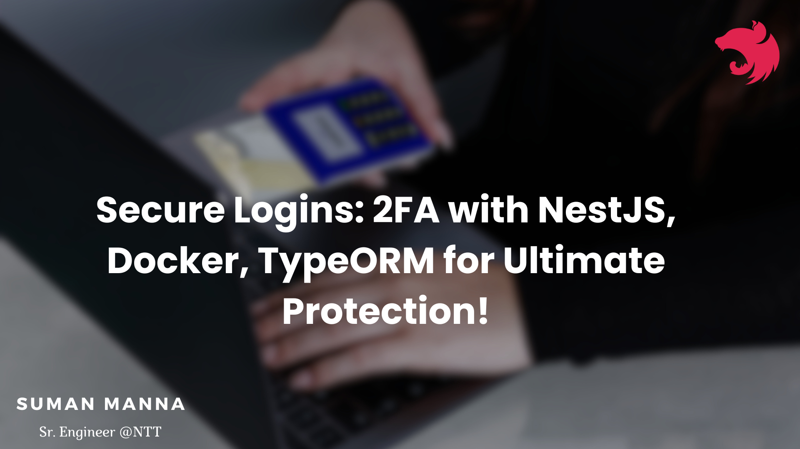
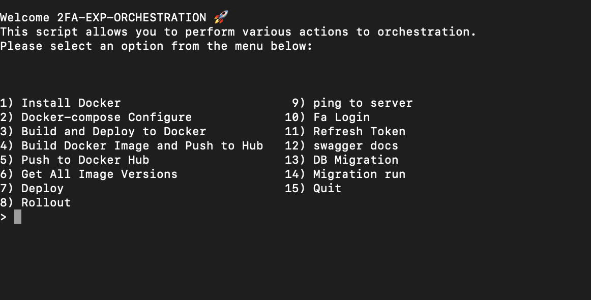
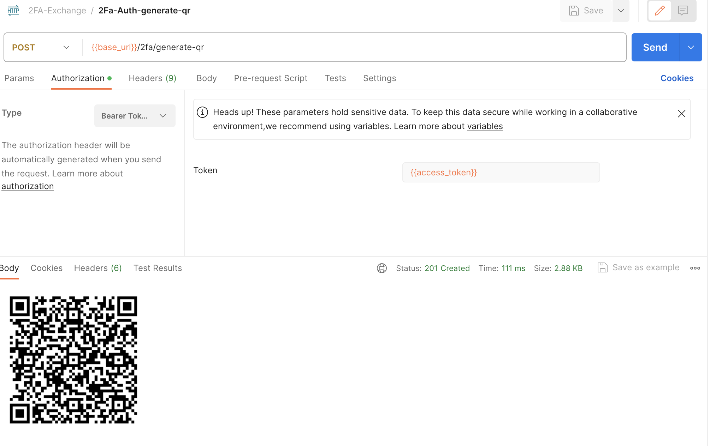

<!-- <p align="center">
  <a href="http://nestjs.com/" target="blank"></a>
</p> -->



  <h3 align="center"></h3>

## Description

🚀 Implementing 2FA Authentication with │
│ NestJS, Docker, and TypeORM │
│ 🔒 Enhance Security: Login Using Any │
│ Authenticator App

## Installation

```bash
$ npm install
```

Create .env file

## Env Create

```bash
DB_TYPE=
POSTGRES_HOST=
POSTGRES_PORT=
DATABASE_USER=
DATABASE_PASSWORD=
DB_NAME=
POSTGRES_USER=
DB_USERNAME=
DB_PASSWORD=
PGADMIN_DEFAULT_EMAIL=
PGADMIN_DEFAULT_PASSWORD=
PGADMIN_LISTEN_PORT=
APP_PORT=3000
JWT_ACCESS_TOKEN_SECRET=
JWT_ACCESS_TOKEN_EXPIRATION_TIME=
JWT_REFRESH_TOKEN_SECRET=anyRefreshKey
JWT_REFRESH_TOKEN_EXPIRATION_TIME=28800
TWO_FACTOR_AUTHENTICATION_APP_NAME=exchange-app

DOCKER_BUILD_IMAGE_NAME=2fa-exchange
DOCKER_REPOSITORY=
```

### Run the Script

## open terminal

```bash
$ chmod +x script.sh
```

## Running the services

```bash
$ ./script.sh
```



## Swagger

```
http://localhost:3000/docs
```

## 2Factor Authentication Endpoints

1. `/2fa/generate-qr`: endpoint likely represents an API endpoint in a web application responsible for generating a QR code to enable two-factor authentication (2FA) for a user.
2. `/2fa/activate`: endpoint is a route in a web application that facilitates the activation process for two-factor authentication (2FA). This endpoint typically handles HTTP POST requests and expects the user to provide necessary information, such as an authentication code, to enable 2FA for their account.
3. `/2fa/authenticate`: endpoint is typically used in the context of two-factor authentication (2FA) within a web application. This endpoint is designed to handle the authentication process when a user attempts to verify their identity using two factors: something they know (e.g., a password) and something they have (e.g., a mobile device).



## Test

```bash
# unit tests
$ npm run test

# e2e tests
$ npm run test:e2e

# test coverage
$ npm run test:cov
```

## Support

Nest is an MIT-licensed open source project. It can grow thanks to the sponsors and support by the amazing backers. If you'd like to join them, please [read more here](https://docs.nestjs.com/support).

## Stay in touch

- Author - [Kamil Myśliwiec](https://kamilmysliwiec.com)
- Website - [https://nestjs.com](https://nestjs.com/)
- Twitter - [@nestframework](https://twitter.com/nestframework)

## License

Nest is [MIT licensed](LICENSE).
